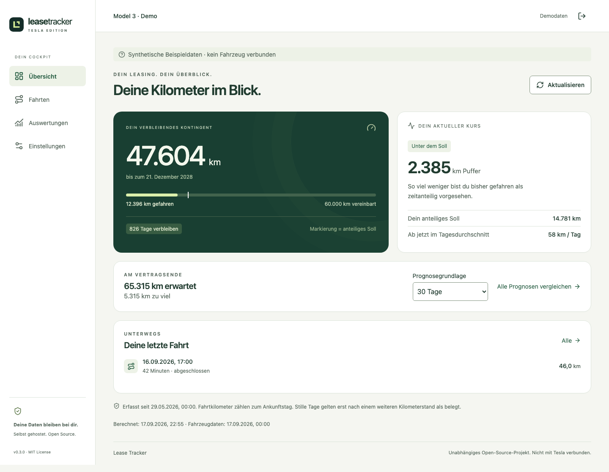
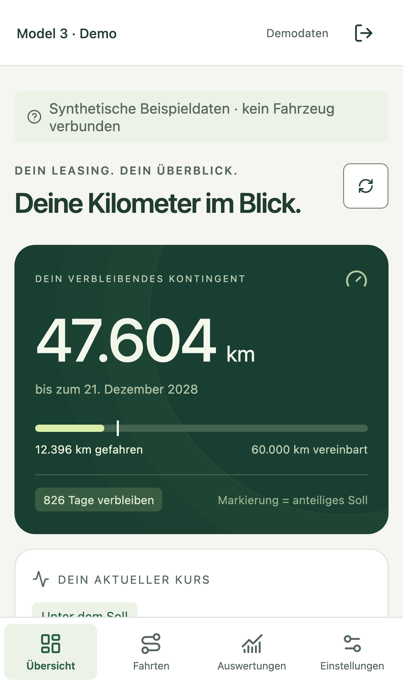
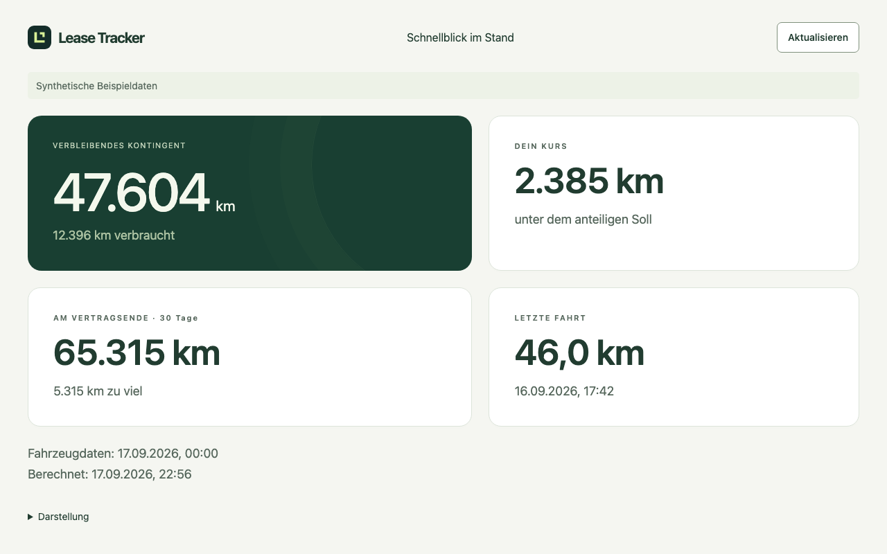

# Tesla Lease Tracker

[](https://github.com/biermann-scale-up-dev/tesla-lease-tracker/actions/workflows/ci.yml)
[](LICENSE)

A self-hosted leasing mileage dashboard for one Tesla Model 3 or Model Y. Automatically capture trips, see your remaining allowance, and compare where different driving patterns would leave you at the end of your lease.

**v0.3.0 is a prerelease. Physical iPhone/Scriptable and Tesla-browser acceptance, real-vehicle pairing, boundary accuracy and recovery remain pending.** See [validation](docs/validation.md) for the exact evidence and outstanding acceptance steps.



## Features

- Automatic start/end odometer readings through official Tesla Fleet Telemetry. No polling, vehicle wake commands, GPS collection or live map.
- Remaining contract mileage, allowance to date, current deviation and remaining daily budget.
- Trips and daily, seven-day, monthly and contract-year mileage views.
- Side-by-side forecasts based on three configurable windows (default 7/30/90 days) and the full contract average.
- Explicit incomplete trips and unassigned mileage. Missing observations never count as proven zero-distance days.
- German mobile app with four navigation sections, light/dark/system appearance, expandable trip cards and installable PWA.
- Offline budgets, forecasts, aggregate history and the latest 20 trips, bounded by the owner session.
- Scriptable iPhone Home/Lock Screen widgets and a parked Tesla-browser quick view, with individually revocable reader access.
- English setup and operator documentation.
- One private owner account per installation, encrypted Tesla tokens, SQLite persistence and daily backups.

Cost per kilometre, notifications, multiple users and older telemetry firmware are outside this milestone.

## Try locally with synthetic data

Requires **Node.js 24 LTS** and npm. The demo calls no Tesla APIs and needs no Docker.

```sh
git clone https://github.com/biermann-scale-up-dev/tesla-lease-tracker.git
cd tesla-lease-tracker
npm ci
npm run setup
npm run demo
npm run build
npm start
```

Open **http://127.0.0.1:3000** and use the app password printed by setup. `.env` contains your password hash and encryption key and must remain private. Setup and the demo refuse to overwrite an existing installation. For development, run `npm run dev` and `npm run dev:web` separately; set `APP_ORIGIN=http://127.0.0.1:5173` in your development `.env`.

The demo flag is visible in the UI, Tesla configuration actions are disabled, and the seeded database must not be reused for a real vehicle. Use a fresh database/volume for deployment.

## PWA and widgets

See [mobile installation, offline behavior and widget setup](docs/mobile-and-widgets.md). The iPhone widget needs Scriptable; the Tesla view runs at `/tesla`. Both read your existing server data without additional vehicle polling.





## Connect a real car

You need a public VPS, Docker Compose, two DNS names, an approved personal Tesla Developer application, and Model 3/Y firmware with Fleet Telemetry **1.3.0 or later** (introduced in **2026.26.6**). Each installation uses its own Tesla application credentials and billing account.

1. Follow [deployment and backups](docs/operations.md) to deploy the app, broker and telemetry receiver.
2. Follow [Tesla onboarding](docs/tesla-setup.md) to register the application, authorize access, pair the virtual key and configure the car.
3. Enter the lease start, return date, handover odometer and agreed **total contract kilometres** in the app.
4. Complete the [real-vehicle acceptance checklist](docs/validation.md) before relying on the results.

Tesla currently provides a **$10 monthly discount**, not an unlimited free tier. A payment method and billing-limit configuration may be required. Verify a zero additional-spend limit in your own Tesla portal. This app never increases it. Hosting and domain costs are separate. Consult [Tesla's current billing documentation](https://developer.tesla.com/docs/fleet-api/billing-and-limits).

## Development and checks

```sh
npm run check
docker compose -f compose.test.yaml up -d --wait
npm run test:broker
npx playwright install chromium webkit
npm run test:e2e
docker compose -f compose.test.yaml down --volumes --rmi all
```

`npm run check` runs lint, strict typing, SQLite/API/domain tests and production builds. The broker test uses real Redpanda and verifies consumer restart/replay. Browser tests run against a fresh SQLite database with synthetic records and test desktop/mobile Chromium and WebKit, including offline data, logout, pairing, revocation and controlled app updates. The dedicated test Compose project must not be pointed at production services.

### Development runtime and restarting

Use Node **24**, including in the terminal that starts development. With nvm, run `nvm install && nvm use` in this repository, then `npm ci`. Installation enforces the supported runtime and `npm run dev` checks it again with an actionable error.

The backend uses Node's native `--watch` with the `tsx` TypeScript loader. It does not use `tsx watch`, whose handling of an already signalled child process can leave restarts waiting for another exit event and accumulate listeners. File changes, recovery after a signalled child exit, Ctrl+C, and shutdown while connecting to an unavailable broker are covered by process integration tests. Shutdown cancels provider requests and retries, closes HTTP/Kafka/SQLite resources, and enforces a four-second deadline with an explicit error if cleanup stalls. Uncommitted Kafka offsets are replayed on restart.

If upgrading from an already stuck development watcher, stop that specific watcher once before restarting. Do not increase EventEmitter listener limits or kill unrelated Node processes.

See [architecture, calculations and API](docs/architecture.md), [contributing](CONTRIBUTING.md), and the [changelog](changelog.md).

## License and independence

Original project code is [MIT licensed](LICENSE). Third-party software retains its own licenses; see [third-party notices](THIRD_PARTY_NOTICES.md). This is an independent community project, not affiliated with or endorsed by Tesla. No Tesla logos, private credentials or real driving records are included.
