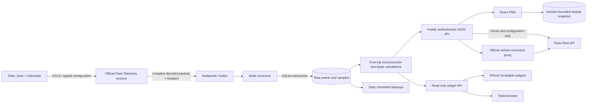

# Architecture and data contract

## Data and delivery

The official receiver is pinned to a source commit and uses `transmit_decoded_records: true`. Kafka topics are `tesla_V` and `tesla_connectivity`. Vehicle data has `vin`, ISO `createdAt`, and `data` entries with keys `Gear` and `Odometer`; values use Tesla's typed protobuf-JSON representation, including `shiftStateValue` and `doubleValue`/`floatValue`/numeric `stringValue`. Invalid readings remain null. Tesla supplies odometer values in miles; conversion is exactly `miles × 1.609344` before display rounding.

The receiver acknowledges vehicle data only after successful Kafka delivery (`reliable_ack_sources: { "V": "kafka" }`). Connectivity events are generated by the receiver and cannot be configured as reliable-ack sources. The consumer commits its Kafka offset only after the SQLite transaction completes. A canonical digest of VIN, vehicle time and sorted signal data deduplicates resend packets regardless of `isResend`. Full accepted payloads and Kafka headers remain in `records`; `samples` contains normalized readings. Derived trips are reconstructed from vehicle-time order on demand so late events are incorporated. Kafka replay is at least once, with idempotent database effects.

The selected VIN is an ingestion allowlist. Unknown VINs, malformed records and unexpected fields are rejected, counted and exposed in service status. Unrequested payloads are not retained because they could contain location data. Rejections are committed only after their diagnostic record is persisted. Operators must investigate rejected records; they are never silently ignored. SQLite migration 1 creates settings, encrypted secrets, sessions, OAuth states, records, samples and rejection diagnostics; migration 2 binds OAuth states to the initiating session; migration 3 adds hashed device credentials and expiring, single-use pairing records.

## Trip semantics and quality

- A known P → D/R/N transition starts a trip. Returning to P ends it immediately. D/R/N changes do not split a trip.
- A stream starting while already in gear creates an incomplete trip. Missing or decreasing odometers invalidate affected distances. A disconnect alone is not an arrival.
- A higher odometer after a parked checkpoint without the corresponding drive boundary is unassigned mileage, not a fabricated trip.
- Raw timestamps are UTC. Display, reporting days and contract boundaries use the configured IANA timezone.
- The whole distance of a trip crossing midnight belongs to its arrival day.
- A daily bucket is complete only when observations bracket the day, no unresolved gap overlaps it and no open/incomplete trip makes it uncertain. A later matching odometer can prove parked days. Silence by itself cannot prove zero mileage.
- The live/current day is excluded from rolling forecasts. The UI separately shows mileage recorded today.

Historical trips before onboarding are unavailable. The handover baseline still provides correct total mileage consumption using a valid current odometer. A missing trip can damage day-level reporting while the total lease consumption remains measurable.

## Lease calculations

`endDate` is an exclusive boundary: the lease period ends at the start of the return day in the configured timezone. Duration uses calendar days, not elapsed 24-hour intervals, so DST does not alter daily allowances. Contract years start on lease anniversaries; Temporal's calendar arithmetic handles leap-day anniversaries.

| Quantity | Calculation |
| --- | --- |
| Used mileage | Latest valid odometer − handover odometer |
| Allowance to date | Total allowance × elapsed contract days / total contract days |
| Remaining mileage | Total allowance − used mileage; negative is meaningful |
| Deviation | Used mileage − allowance to date |
| Remaining daily budget | Remaining mileage / remaining contract days |
| Window forecast | Used mileage + complete-window average/day × remaining days |
| Contract forecast | Used mileage + used mileage / elapsed contract days × remaining days |

The three rolling windows are independently configurable from 1–365 days. A window needs all its completed days to be evidenced, including parked days; otherwise its result is null with an explanation. The contract average can operate immediately after mid-contract onboarding when its baseline and odometer are known. No future forecast is calculated after the contract ends. Results always identify the last odometer observation and capture start; forecasts assume the selected historic rate continues.

## HTTP interfaces

Shared TypeScript types live in `src/shared/types.ts`; request bodies are validated using strict Zod schemas. All `/api` responses use `Cache-Control: no-store`. Authentication uses an HttpOnly, SameSite=Lax session cookie; production cookies are Secure. Mutating browser requests require an exact `Origin` match with `APP_ORIGIN`. The sole native-client exception is `/api/pairing/claim` without Origin or Cookie headers, authenticated by a single-use pairing code (and the browser secret for Tesla pairings).

| Endpoint | Purpose |
| --- | --- |
| `GET /api/session` | `{ authenticated, expiresAt }`, with epoch milliseconds or null |
| `POST /api/login`, `/api/logout` | Private owner session |
| `GET /api/dashboard` | Contract, preferences, computed summary, Tesla and service status |
| `PUT /api/contract` | `startDate`, `endDate`, `handoverKm`, `totalKm`, `timeZone` |
| `PUT /api/preferences` | Three integer `windows` |
| `POST /api/tesla/register`, `/authorize` | Partner registration and owner OAuth URL |
| `GET /api/tesla/callback` | Session-bound, single-use OAuth callback |
| `GET /api/tesla/vehicles`, `/pairing` | Supported vehicles and virtual key link |
| `PUT /api/tesla/vehicle` | Select a VIN from the authorized account |
| `POST /api/tesla/check`, `/configure`, `/disconnect` | Validate, configure or stop telemetry |
| `GET /api/widget-summary` | Reader-only `WidgetSummary` v1; no VIN or credentials; identical domain calculations |
| `GET /api/devices` | Owner-only named reader devices and last successful use |
| `PUT /api/devices/:id`, `DELETE /api/devices/:id` | Owner-only name/forecast update or immediate credential revocation |
| `POST /api/pairing/scriptable` | Owner-only creation of a ten-minute code; body `{ name, forecastBasis }` |
| `POST /api/pairing/tesla` | Rate-limited browser pairing initiation, returning code, browser secret, expiry and approval URL |
| `POST /api/pairing/approve` | Owner consent; body `{ code, name, forecastBasis }` |
| `POST /api/pairing/claim` | Single-use exchange; body `{ code, secret? }`; 202 pending, 200 reader credential/cookie |
| `GET /healthz` | Process liveness only; not proof of vehicle connectivity |

Errors return `{ "error": "actionable message" }` with the appropriate HTTP status. Provider calls have timeouts and bounded retries for transient errors. OAuth token exchanges are not blindly retried because codes and refresh tokens rotate. A serialized refresh updates encrypted tokens atomically; failed refresh requires reconnecting. A background hourly refresh keeps unattended installations authorized.

Reader access uses an opaque bearer token for Scriptable or a dedicated Secure/HttpOnly/SameSite=Strict cookie scoped to `/api/widget-summary` for the Tesla browser. Device secrets are SHA-256 hashed in SQLite. Pairing approval and claim are separate; claim atomically consumes the code and creates the credential. The default forecast basis is `window-1`; alternatives are `window-0`, `window-2` and `contract`. Missing data remains null with a reason. See [mobile and widgets](mobile-and-widgets.md) for storage lifetimes and operational setup.

## Boundaries

One process owns ingestion; one user and one vehicle own the database. SQLite WAL supports a concurrent backup process. This is a single-host prerelease, not a highly available fleet platform. The service worker does not cache personal API data. The public GitHub repository contains application source and synthetic documentation data only. Every deployed instance is private by default.
